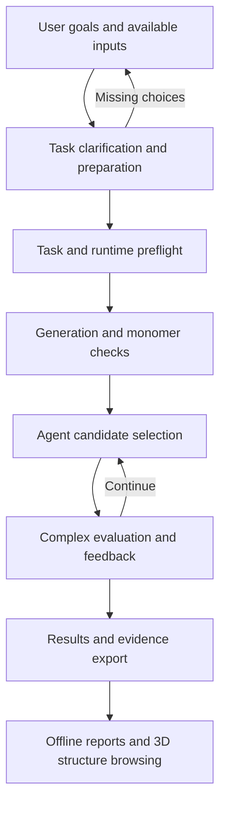

# Agentic Loop for Protein Design (ALPD)

[简体中文](README.zh-CN.md) · [GitHub](https://github.com/ziiroo1126/Agentic-Loop-for-Protein-Design)

ALPD provides reproducible protein-design workflows and scientific tools for host
agents, connecting candidate generation, evaluation and feedback-guided selection.
The Python core manages scientific tasks, model execution, bounded
candidate selection, persistent records and portable result bundles. Host adapters
are packaged as skills and plugins for Codex, Claude Code and DeepSeek Harness.

The current workflow connects ODesign generation, ESMFold monomer checks and
ESMFold2 complex evaluation. Public-data benchmarks and repeated host decisions
have been recorded; a stable LLM selection advantage has not been demonstrated.
The next research question concerns adaptive allocation of additional evaluations.

Users can start with a description and available target information. The host records
an incomplete design brief; `task review` lists missing choices, and `task build`
checks structure/residue mapping before compiling an execution task. Briefs can retain
unspecified hotspots and length ranges; the complete backend requires explicit hotspots
and a fixed length before execution.



## Demo and visualization

The [five-minute demo](interaction-design-mvp/docs/DEMO.md) walks through input
preparation, saved decisions and interactive results. Extract the demo ZIP, keep
the files together and open `alpd-demo/index.html` in a browser. Browsing requires
no model environment, GPU, server or Internet connection; 3D rendering requires
JavaScript and WebGL. Use the “open separately” links if your browser restricts
embedded local pages.

| Demo chapter | What you can explore |
| --- | --- |
| 01 · Prepare a task | Missing-input report, draft download and a saved complete task |
| 02 · Replay a run | Workflow diagram, candidate metrics, selection reasons and evaluation feedback, step by step |
| 03 · Browse structures | Interactive **3Dmol.js** viewer: switch candidates and structures, rotate, zoom, toggle chains, inspect residues and save PNG images |
| 04 · Reevaluate and reflect | A separate recorded host case with sequential predictions, query counts and reflections |
| 05 · Run your own task | CLI commands for preparation, execution, decisions and export |


The screenshot shows a saved development result. The demo replays existing records;
clicking through does not run models or request new Agent decisions. The reevaluation
case uses a different candidate pool from the main pipeline example. These records
do not establish experimental binding or a stable Agent selection advantage.

To build the walkthrough from a completed result bundle, run from the repository
root with the prepared Python environment:

```bash
interaction-design-mvp/.venv/bin/python interaction-design-mvp/scripts/build_demo.py \
  --result-bundle /absolute/path/to/completed-result-bundle \
  --output interaction-design-mvp/artifacts/alpd-demo
```

This creates `interaction-design-mvp/artifacts/alpd-demo/index.html` and
`interaction-design-mvp/artifacts/alpd-demo.zip`. Use a fresh output path.
The generated demo and source model results are local artifacts, excluded from Git;
a fresh clone needs an existing result bundle to build this combined demo.
Without one, start with the included [PD-L1 replay](docs/evidence/adaptive-loop-pdl1/index.html)
or the [synthetic CPU example](interaction-design-mvp/docs/ADAPTIVE.md).
Download or clone the replay files before opening the HTML; GitHub file previews
do not execute interactive pages.

New `pipeline export` bundles automatically include a standalone 3D viewer at
`index.html`. For an existing bundle, use `interaction-design viewer export
/path/to/result-bundle --output /path/to/new-viewer.html`.
See the [structure viewer guide](interaction-design-mvp/docs/STRUCTURE_VIEWER.md)
for supported formats and controls, and the [adaptive guide](interaction-design-mvp/docs/ADAPTIVE.md)
for sequential reevaluation and replay.

## Repository

```text
interaction-design-mvp/      Python package, tests, protocols and examples
  src/interaction_design/   Scientific workflow and command-line interface
  config/                   Pinned assets and evaluation protocols
  docs/                     Runtime and benchmark guides
  artifacts/                Local experiment outputs (ignored by Git)
  models/, data/            Local model assets and external data (ignored by Git)
plugins/                   Shared skill and host adapters
docs/                      Project plan, research goal and experiment evidence
.github/workflows/         Python continuous integration
```

## Start here

With the existing Python development environment, run from the repository root:

```bash
cd interaction-design-mvp
.venv/bin/interaction-design --help
.venv/bin/interaction-design task --help
.venv/bin/interaction-design validate examples/ligand_binder.json
.venv/bin/interaction-design pipeline --help
```

For environment preparation and a CPU-only example, see the
[Python package guide](interaction-design-mvp/README.md).
For host integration, see the [plugin guide](plugins/molclaw/README.md).
The [pipeline guide](interaction-design-mvp/docs/PIPELINE.md) covers task preparation,
execution, candidate decisions and export.
For incomplete user requirements, start with the
[task input guide](interaction-design-mvp/docs/TASK_INPUT.md).

## Development and research

- [Contributing and local checks](CONTRIBUTING.md)
- [Project plan](docs/PROJECT_PLAN.md)
- [Implementation and validation records](docs/M1_STATUS.md)
- [Current research goal](docs/RESEARCH_GOAL.md)
- [Recorded experiments](docs/evidence/)

Model weights, environments and full experiment outputs are local resources. They
are not included in a fresh clone. Reuse caches and existing environments before
downloading or installing dependencies.

## Licenses

The original [repository license](LICENSE), [Python package license](interaction-design-mvp/LICENSE)
and upstream notices under `interaction-design-mvp/config/` are retained.
