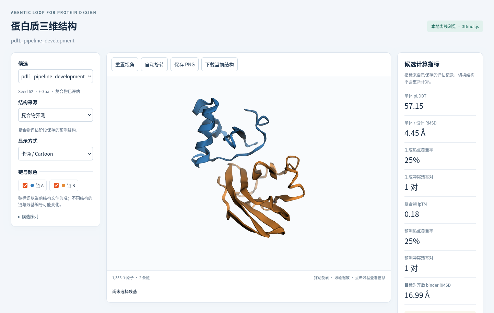

# Agentic Loop for Protein Design (ALPD)

[English](README.md) · [在线演示](https://ziiroo1126.github.io/Agentic-Loop-for-Protein-Design/) · [快速开始](docs/QUICKSTART.md) · [版本发布](https://github.com/ziiroo1126/Agentic-Loop-for-Protein-Design/releases)

**把蛋白质 binder 任务交给 Agent，查看它的决策、工具反馈和三维结构。**

ALPD 连接用户提供的设计要求、ODesign 候选生成、ESMFold v1 单体检查、
Agent 引导的 ESMFold2 复合物评估，以及可追溯的结果导出。
Python 核心执行科学工具并检查动作；宿主提供决策模型。默认入口是 Codex skill。

**0.1.0 研究预览版。** 当前完整流程支持一个固定长度的线性蛋白 binder 和一个固定蛋白靶标。
计算指标不能证明实验结合，现有记录也尚未证明稳定的 LLM 筛选优势。
支持范围见[已知限制](docs/LIMITATIONS.md)。

[](https://ziiroo1126.github.io/Agentic-Loop-for-Protein-Design/demo/structures.html)

## 选择一种开始方式

| 想做什么 | 需要准备 | 使用入口 | 得到什么 |
| --- | --- | --- | --- |
| 直接看演示 | 支持 JavaScript 和 WebGL 的浏览器 | [在线图库](https://ziiroo1126.github.io/Agentic-Loop-for-Protein-Design/)／[离线 ZIP](https://ziiroo1126.github.io/Agentic-Loop-for-Protein-Design/downloads/alpd-demo.zip) | 决策回放、可旋转的三维结构与下载 |
| 不用模型跑一个示例 | Python 3.12/3.13、uv | [CPU 快速开始](docs/QUICKSTART.md#2-run-the-cpu-example) | 新的合成数据会话和 HTML 报告 |
| 执行真实设计 | 目标结构、设计约束、已配置的 GPU 模型环境 | [环境指南](docs/RUNTIME.md)＋[Codex 接入](docs/CODEX.md) | 新候选、评估和结果包 |

克隆仓库后，在已有 uv 的环境中执行：

```bash
bash tools/setup.sh --python 3.12
source interaction-design-mvp/.venv/bin/activate
python tools/cpu_demo.py --output /tmp/alpd-cpu-demo
```

打开 `/tmp/alpd-cpu-demo/view/index.html`。该示例使用虚构测量和固定策略，
无需下载模型，也不调用 LLM。输出目录须不存在。克隆、安装条件及预期结果见[完整指南](docs/QUICKSTART.md)。

## 在 Codex 中调用

完成 CPU 安装后，把完整 skill 链接到工作项目：

```bash
export ALPD_PROJECT_ROOT="$PWD"
mkdir -p /tmp/alpd-work
python tools/alpd.py install --host codex --project-dir /tmp/alpd-work
python tools/alpd.py doctor --host codex --project-dir /tmp/alpd-work
cd /tmp/alpd-work
codex
```

在会话中用 `$alpd:alpd` 提供任务、运行配置和评估预算。
[接入指南](docs/CODEX.md)提供了可直接使用的首次 CPU 宿主示例和真实任务提示词。
Codex 使用自己的已配置模型账户；ALPD 无需额外的 LLM API Key。
Claude Code 和 DeepSeek 接入按各自的实际验证范围说明。

## 闭环如何工作


用户输入可以先不完整：`task review` 列出待补齐项，`task build` 在执行前检查结构与残基映射。
当前实时闭环支持选择评估和停止；根据反馈自动修改设计并重新生成属于后续工作。
独立的 `adaptive` 流程读取缓存预测并保存计划、复盘，不启动新的 GPU 推理。

## 可查看和复现的案例

- **[完整 binder 主案例](examples/pdl1-binder/README.md)**：原始任务、两个生成候选、真实宿主选择、
  复合物反馈、预算停止和三维结构。仓库内包含结果、软件来源和校验信息。
- **[独立复评案例](https://ziiroo1126.github.io/Agentic-Loop-for-Protein-Design/demo/replay/index.html)**：
  在另一组已有的 90 个候选上，查看三次历史查询和复盘。
- **[CPU 合成示例](docs/QUICKSTART.md#2-run-the-cpu-example)**：验证软件安装与流程，数据为虚构，策略为固定基线。

无需模型即可重建整个图库：

```bash
python tools/build_site.py --output /tmp/alpd-site
```

打开 `/tmp/alpd-site/index.html`；离线包与校验文件在 `downloads/`。
三维浏览支持候选和结构切换、旋转缩放、链显隐、残基查看、PNG 保存和原始结构下载。
独立页面内嵌 3Dmol.js 与数据，无需 CDN。浏览页面不会启动计算或产生新 Agent 决策。

## 文档和目录

[用户指南](docs/README.md) · [发布验证](docs/RELEASE_VERIFICATION.md) · [参与开发](CONTRIBUTING.md) · [更新记录](CHANGELOG.md) · [研究目标](docs/RESEARCH_GOAL.md)

```text
interaction-design-mvp/   Python 核心、模型适配与科学测试
plugins/alpd/            ALPD 共享 skill 和宿主适配
tools/                   安装、CPU 示例、图库和发布检查
examples/pdl1-binder/     原始便携案例与复现说明
docs/                    用户指南、发布说明和历史证据
.github/                 CI、发布流程和问题模板
```

模型、环境和完整本机实验目录不进入 Git。历史实验记录保留在 `docs/evidence/`，
与当前使用指南分别导航。下载优先复用缓存并尝试直连。

## 许可

保留仓库的 [MIT 许可证](LICENSE)，Python 核心采用 [Apache-2.0](interaction-design-mvp/LICENSE)。
模型和外部数据适用各自的条款；见[第三方来源与许可说明](THIRD_PARTY_NOTICES.md)。
