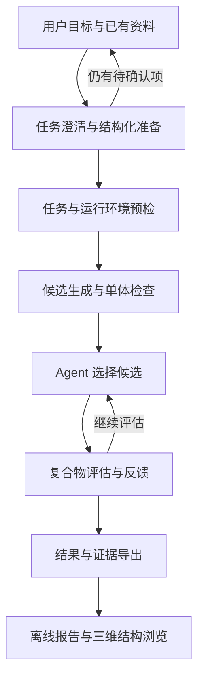

# Agentic Loop for Protein Design (ALPD)

[English](README.md) · [GitHub](https://github.com/ziiroo1126/Agentic-Loop-for-Protein-Design)

ALPD 围绕蛋白质设计的智能体闭环，连接候选生成、评估和基于反馈的选择，
提供可复现的设计流程，以及供宿主 Agent 调用的科学工具。
Python 核心负责科学任务、模型执行、有预算约束的候选选择、状态记录与结果导出；
宿主接入以 Codex、Claude Code 和 DeepSeek Harness 的 skill／插件形式交付。

当前流程连接 ODesign 生成、ESMFold 单体检查和 ESMFold2 复合物评估。
已有公开数据评测及宿主重复实验记录，尚未证明稳定的 LLM 筛选优势。
下一阶段研究自适应分配追加评估机会的作用。

用户可以先提供目标描述和已有资料，由宿主 Agent 整理为允许信息暂缺的任务草稿。
`task review` 列出待确认项；条件齐全后，`task build` 核对结构与残基映射并生成执行任务。
热点和长度范围可以先记录在草稿中；当前完整后端仍要求明确热点和固定长度。



## Demo 与可视化

[五分钟上手 Demo](interaction-design-mvp/docs/DEMO.md) 展示任务准备、已有决策与交互式结果。
拿到演示 ZIP 后，解压并保留目录内全部文件，用浏览器打开 **`alpd-demo/index.html`**。
浏览 Demo 无需模型环境、GPU、服务或网络；三维浏览需要启用 JavaScript 和 WebGL。
如果浏览器限制本地嵌入页面，可使用页面上的“独立打开”链接。

| 演示章节 | 可以查看或操作的内容 |
| --- | --- |
| 01 · 准备任务 | 查看缺失输入报告、下载草稿、展开已有完整任务 |
| 02 · 回看运行 | 查看流程图和候选指标表，逐步回放选择理由与评估反馈 |
| 03 · 三维浏览 | 使用 **3Dmol.js** 切换候选和结构，旋转缩放、显示／隐藏链、点击残基、保存 PNG |
| 04 · 复评与复盘 | 查看另一组宿主案例中的逐轮预测、查询次数与复盘判断 |
| 05 · 自己运行 | 查看任务准备、执行、决策提交和结果导出的实际命令 |


上图为已保存的开发结果。Demo 回放已有记录，点击页面不会运行模型或发起新的 Agent 决策。
复评案例与主线生成任务使用不同的候选池。这些记录不代表实验结合验证，也未证明
Agent 具有稳定的筛选优势。

已有完整结果包和 Python 开发环境时，可在仓库根目录重建 Demo：

```bash
interaction-design-mvp/.venv/bin/python interaction-design-mvp/scripts/build_demo.py \
  --result-bundle /absolute/path/to/completed-result-bundle \
  --output interaction-design-mvp/artifacts/alpd-demo
```

命令生成 `interaction-design-mvp/artifacts/alpd-demo/index.html` 和
`interaction-design-mvp/artifacts/alpd-demo.zip`，输出路径须不存在。
演示包和源模型结果均为本机产物，不进入 Git；新克隆仓库需要提供已有结果包才能重建
这个组合 Demo。没有结果包时，可先打开仓库附带的
[PD-L1 回放](docs/evidence/adaptive-loop-pdl1/index.html)，或运行
[合成数据 CPU 示例](interaction-design-mvp/docs/ADAPTIVE.md)。
回放文件需要下载或克隆后用浏览器打开，GitHub 文件预览不会执行交互页面。

新执行的 `pipeline export` 会自动附带三维页面 `index.html`；已有结果包可使用
`interaction-design viewer export /path/to/result-bundle --output /path/to/new-viewer.html`
单独生成页面。结构格式与操作见[三维浏览指南](interaction-design-mvp/docs/STRUCTURE_VIEWER.md)，
连续复评与回放见[自适应使用指南](interaction-design-mvp/docs/ADAPTIVE.md)。

## 目录结构

```text
interaction-design-mvp/      Python 包、测试、协议与任务示例
  src/interaction_design/   科学工作流与命令行入口
  config/                   固定版本资产与评估协议
  docs/                     运行和评测说明
  artifacts/                本机实验产物，Git 忽略
  models/、data/            本机模型资产与外部数据，Git 忽略
plugins/                   共享 skill 与宿主适配
docs/                      项目计划、研究目标与实验记录
.github/workflows/         Python 持续集成
```

## 使用入口

本机已经准备好 Python 开发环境时，在仓库根目录执行：

```bash
cd interaction-design-mvp
.venv/bin/interaction-design --help
.venv/bin/interaction-design task --help
.venv/bin/interaction-design validate examples/ligand_binder.json
.venv/bin/interaction-design pipeline --help
```

环境准备和纯 CPU 示例见 [Python 包说明](interaction-design-mvp/README.md)，
宿主接入见 [插件说明](plugins/molclaw/README.md)，
完整任务到导出流程见 [Pipeline 指南](interaction-design-mvp/docs/PIPELINE.md)。
从不完整需求开始时，先看[任务输入与准备指南](interaction-design-mvp/docs/TASK_INPUT.md)。

## 开发与研究记录

- [开发和本地检查](CONTRIBUTING.md)
- [项目计划](docs/PROJECT_PLAN.md)
- [实施与验证记录](docs/M1_STATUS.md)
- [当前研究目标](docs/RESEARCH_GOAL.md)
- [实验记录](docs/evidence/)

模型权重、虚拟环境和完整实验产物属于本机资源，新克隆仓库不会自动获得。
下载或安装前优先复用本地缓存与现有环境。

## 许可

保留原始[仓库许可证](LICENSE)、[Python 包许可证](interaction-design-mvp/LICENSE)
以及 `interaction-design-mvp/config/` 中的上游许可声明。
